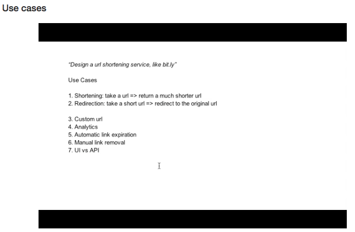
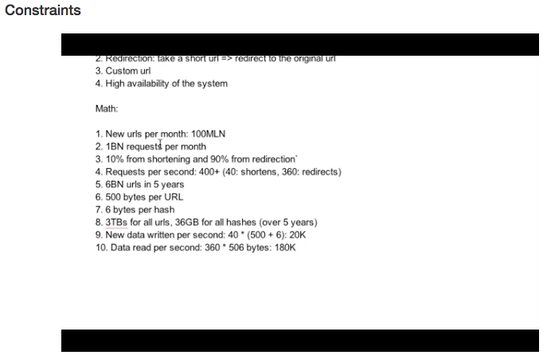
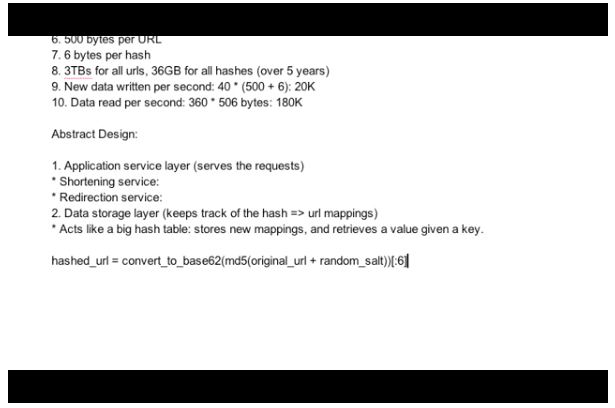
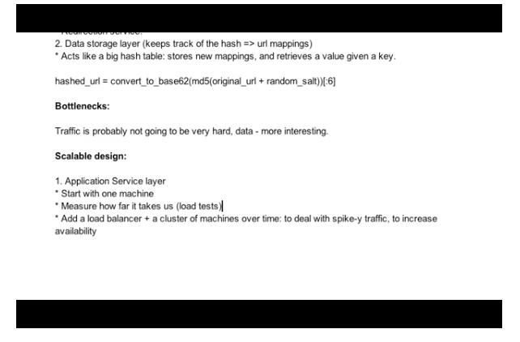
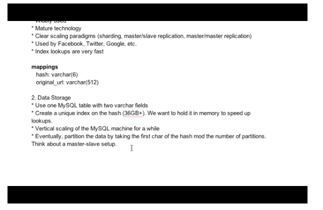

Steps for System Design Questions

Steps
```
1. Use Cases
2. Constraints
3. Abstract Design
4. Bottleneck
5. Scalability

```

## Use Cases



## Constraints



## Abstract Design



## Bottleneck



## Scalability




